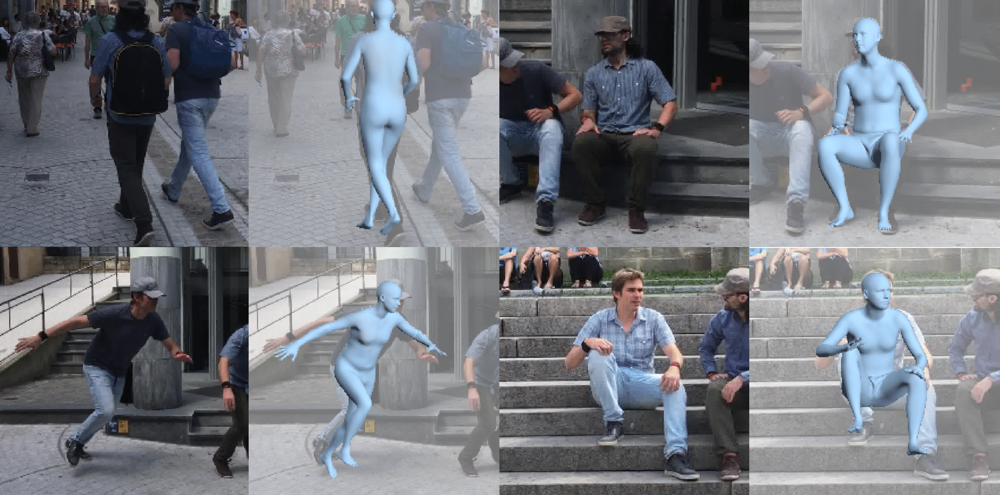

# VQ-HPS

This repository implements the human mesh recovery model introduced in the ECCV-2024 paper: [VQ-HPS](https://g-fiche.github.io/research-pages/vqhps/).

If you find this code useful, please consider citing the associated [paper](https://g-fiche.github.io/research-pages/vqhps/).




## Installation

### Create environment

    conda create -n vqhps python=3.9
    conda activate vqhps


### Install pytorch

    conda install pytorch=1.13.0 torchvision pytorch-cuda=11.6 -c pytorch -c nvidia


### Install pytorch3d

    # Install dependencies for pytorch3d
    conda install -c fvcore -c iopath -c conda-forge fvcore iopath
    conda install -c bottler nvidiacub

    # Install pytorch3d
    conda install pytorch3d -c pytorch3d

Please refer to the official [pytorch3d](https://github.com/facebookresearch/pytorch3d/blob/main/INSTALL.md) documentation for installation.

### Install other dependencies

    python -m pip install -r requirements.txt


## Data

This repository relies on various external downloads in order to run the code. Here is a description of each of them.

First, we create folders to store the downloads:
    mkdir body_models
    mkdir datasets
    mkdir checkpoint

### Checkpoints

Checkpoints are available [here](https://zenodo.org/records/12651812). Download them under the ```checkpoint``` directory. The structure should look as the following:
```
${checkpoint}  
|-- MESH_REGRESSOR
|   |-- vqhps_hrnet
|   |-- vqhps_resnet
|-- MESH_VQVAE
|   |-- mesh_vqvae_54
```  


### Body models

The [SMPL-H](https://mano.is.tue.mpg.de/index.html) body model is used to obtain human meshes. To install the body model:
- Create an account on the [project-page](https://mano.is.tue.mpg.de/index.html)
- Go to the Downloads page and download the "Extended SMPL+H model (used in AMASS)". Place the downloaded smplh.tar.xz in the ```body_models``` folder and extract it.
- This should create a ```smplh``` folder. Rename the ```male``` subfolder to ```m``` and the ```female``` subfolder to ```f```.

Since VQ-HPS is non-parametric, we need joint regressors to compute the position of body joints.
- The SMPL 24 joints regressor can be extracted from the SMPL model downloaded below as the ```J_regressor.npy``` is one of the files contained in ```model.npz```.
- The Human3.6M joints extractor can be downloaded [here](https://github.com/open-mmlab/mmhuman3d/blob/main/docs/getting_started.md#body-model-preparation).
- Place both joint extractors under the ```body_models``` folder and rename them ```J_regressor_24.npy``` and ```J_regressor_h36m.npy```.

### Mesh-VQ-VAE

VQ-HPS relies on a quantized representation of human meshes obtained by Mesh-VQ-VAE, a VQ-VAE architecture adapted to fixed topology human meshes.

Clone the [Mesh-VQ-VAE](https://github.com/g-fiche/Mesh-VQ-VAE) repository aside from the VQ-HPS directory, and copy the ```mesh_vq_vae``` folder in the VQ-HPS directory.

Follow the instructions of [Mesh-VQ-VAE](https://github.com/g-fiche/Mesh-VQ-VAE) for downloading the files associated with the fully convolutional mesh autoencoder and place them in the ```body_models``` folder.


### Pretrained backbone

The pretrained HRNet backbone can be downloaded from the original [HRNet](https://github.com/leoxiaobin/deep-high-resolution-net.pytorch) repository.

Place it in the ```body_models``` folder and rename it ```pose_hrnet_w48.pth```.


### Datasets

For the training datasets, we use the SMPL annotations provided in [Bedlam](https://bedlam.is.tue.mpg.de/index.html). Please follow the instructions [here](https://github.com/pixelite1201/BEDLAM/blob/master/docs/training.md) in the section ```Training CLIFF model with real images``` to download the training images and annotations. After download, you should have the following structure in the dataset folder:
```
${dataset}  
|-- coco
|   |-- train2014
|   |-- coco.npz
|-- mpii
|   |-- images
|   |-- mpii.npz
|-- h36m_train
|   |-- Images
|   |   |-- S1 
|   |   |-- S2 ..
|   |-- h36m_train.npz
|-- mpi-inf-3dhp
|   |-- S1
|   |-- S2 ..
|   |-- mpi_inf_3dhp_train.npz
```  

For the testing datasets, we use [3DPW](https://virtualhumans.mpi-inf.mpg.de/3DPW/) and [EMDB](https://eth-ait.github.io/emdb/):
- Download the datasets from the official websites linked above.
- Prepare the annotations npz files using the scripts in ```preprocess_data```.


## Train

You can train VQ-HPS by running:

    python train_mesh_regressor.py

The configuration of the model used in [VQ-HPS](https://g-fiche.github.io/research-pages/vqhps/) can be found under ```configs/config```. 


## Test and analyze

VQ-HPS can be tested using:

    python test_mesh_regressor.py

The testing dataset can be modified in the ```configs/config``` file. To test the ResNet model, simply change ```hrnet_w48``` to ```resnet50``` in the config file and modify the path accordingly in ```test_mesh_regressor.py```.


## Acknowledgements

This study is part of the EUR DIGISPORT project supported by the ANR within the framework of the PIA France 2030 (ANR-18-EURE-0022). This work was performed using HPC resources from the “Mésocentre” computing center of CentraleSupélec, École Normale Supérieure Paris-Saclay, and Université Paris-Saclay supported by CNRS and Région Île-de-France.

Some code in this repository is adapted from the following repositories:
- [VQ-MAE-S](https://github.com/samsad35/VQ-MAE-S-code)
- [Pose-NDF](https://github.com/garvita-tiwari/PoseNDF/tree/version2)
- [HuMoR](https://github.com/davrempe/humor)
- [FastMETRO](https://github.com/postech-ami/FastMETRO)
- [BEDLAM](https://github.com/pixelite1201/BEDLAM)
- [T2M-GPT](https://github.com/Mael-zys/T2M-GPT)


## Citation

    @inproceedings{fiche2024vq,
        title={VQ-HPS: Human Pose and Shape Estimation in a Vector-Quantized Latent Space},
        author={Fiche, Gu{\'e}nol{\'e} and Leglaive, Simon and Alameda-Pineda, Xavier and Agudo, Antonio and Moreno-Noguer, Francesc},
        booktitle={European Conference on Computer Vision ({ECCV})},
        year={2024}
    }